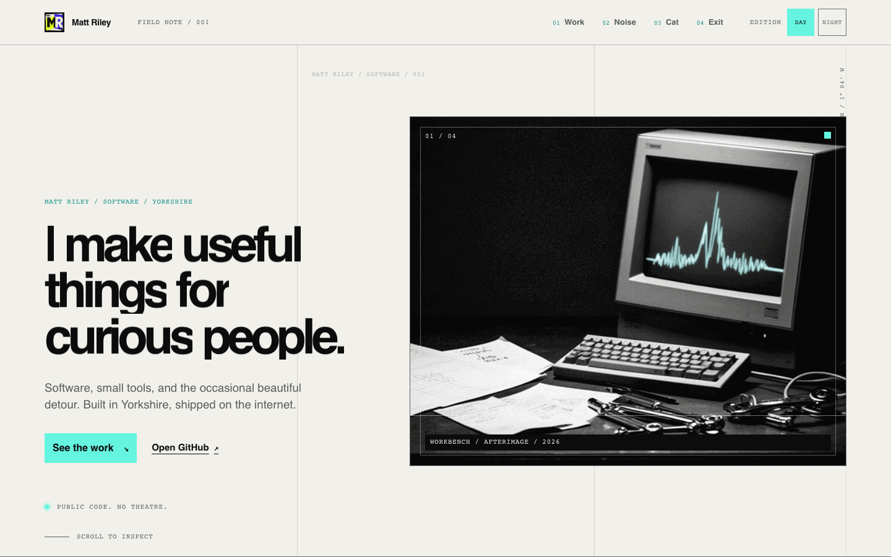

# matt-riley.dev

**Afterimage** — a single-page developer field note for matt-riley.dev, built
with Astro and vanilla TypeScript. No React, no Tailwind, no runtime-random
layout. The current visual contract lives in
[brand-spec.md](brand-spec.md).

Designed for [matt-riley.dev](https://matt-riley.dev).



## Local development

```sh
pnpm install
pnpm dev        # dev server on http://localhost:4321
pnpm build      # static build into dist/
pnpm preview    # serve the production build
pnpm check      # astro check (types + diagnostics)
```

## GitHub data

The build fetches the public GitHub profile, repositories, public events, and
releases from the five selected repositories for `matt-riley` at build time,
then normalizes them into one typed dossier (`src/data/github.ts`). Data
selection is atomic: if any request fails, times out, or looks malformed, the
whole page falls back to the checked-in last-known-good snapshot in
`src/data/fallback.ts` and the dossier is stamped `ARCHIVE PRINT` instead of
`LIVE PRESS`.

- `GITHUB_TOKEN` (optional) raises the API rate limit; it never reaches the client.
- `GITHUB_DATA=fallback` skips the live fetch entirely for deterministic builds.

## Editions

The `DAY / NIGHT` control switches between the warm copier-paper day edition
and the after-hours print-room night edition. The choice persists in
`localStorage`, respects `prefers-color-scheme` on first visit, and resolves
before first paint.

## Architecture

- Astro static output with vanilla TypeScript; no React or Tailwind.
- GSAP + ScrollTrigger and Lenis provide the guarded scroll narrative.
- A deterministic canvas renders the GitHub signal field; the pointer trail is
  limited to fine pointers and has reduced-motion fallbacks.
- The browser has no data-fetching requirement. GitHub is read at build time;
  the checked-in snapshot takes over when the API is unavailable.

## Project layout

- `src/components/` — the page's semantic sections and shared chrome.
- `src/data/` — typed GitHub normalization and fallback data.
- `src/scripts/` — theme, navigation, tabs, canvas, and motion enhancements.
- `src/styles/` — the Afterimage visual system and responsive rules.
- `public/images/` — the local hero and Waffle editorial assets.

## Cloudflare Workers

This is configured as a static Astro build deployed to Cloudflare Workers
Assets:

- Build command: `pnpm run build`
- Deploy command: `npx wrangler deploy` (or `pnpm run deploy` locally)
- Build output directory: `dist`
- Wrangler config: `wrangler.jsonc`
- Astro mode: `output: "static"`
- Cloudflare adapter: none required; `@astrojs/cloudflare` is for SSR runtime
  features and would be unnecessary for this pre-rendered site.

The Wrangler configuration intentionally has no `main` entry point. It uploads
Astro's generated `dist/` directory as static assets and uses the generated
`404.html` for missing routes.

## Reuse

This repository currently has no license. Public visibility does not grant
permission to reuse the code, copy, or visual assets without the author's
permission.
